# FileFlow — Real-Time Text & Paragraph Transfer

> **Version:** 2.0 | **Updated:** 2026-01-13 | **Scope:** MVP (Text + Paragraphs)

---

## Table of Contents

1. [Overview](#1-overview)
2. [Product Goals](#2-product-goals)
3. [Architecture](#3-architecture)
4. [Security Model](#4-security-model)
5. [Data Model](#5-data-model)
6. [HTTP API](#6-http-api)
7. [WebSocket Protocol](#7-websocket-protocol)
8. [State Machines](#8-state-machines)
9. [Error Handling](#9-error-handling)
10. [Frontend Implementation](#10-frontend-implementation)
11. [Backend Design](#11-backend-design)
12. [Docker Deployment](#12-docker-deployment)
13. [Configuration Reference](#13-configuration-reference)
14. [Testing Strategy](#14-testing-strategy)
15. [Acceptance Criteria](#15-acceptance-criteria)
16. [Roadmap](#16-roadmap)

---

## 1. Overview

**FileFlow** is an ultra-minimal, **ephemeral** text transfer system for **real-time** exchange between **two authorized devices** that are **online simultaneously**.

### 1.1 What FileFlow Is

| Feature | Description |
|---------|-------------|
| Text Transfer | Send plain text between two devices |
| Paragraph Preservation | Maintain paragraph structure and line breaks |
| Streaming UI | Progressive content display (chat-like) |
| Online-Only | No offline queue, no persistent history |

### 1.2 What FileFlow Is NOT

- ❌ Chat application
- ❌ Notes application  
- ❌ File-sharing service
- ❌ Offline-capable system

---

## 2. Product Goals

### 2.1 MVP Goals

| ID | Goal | Description |
|----|------|-------------|
| G1 | Two-device sync | Real-time streaming when both devices online |
| G2 | Paragraph-aware | Preserve paragraph boundaries exactly |
| G3 | Streaming UX | Progressive content appearance |
| G4 | Online constraint | Delivery only if peer online at `msg_start` |
| G5 | Security gate | Device whitelist + secret authentication |
| G6 | Docker deployment | Single-command deployment via Docker Compose |

### 2.2 Non-Goals (Deferred)

- Files / uploads / downloads
- Document management (titles, folders, versions)
- Offline delivery / queueing
- Multi-user accounts, OAuth
- End-to-end encryption of message content
- Analytics beyond operational counters

---

## 3. Architecture

### 3.1 System Overview

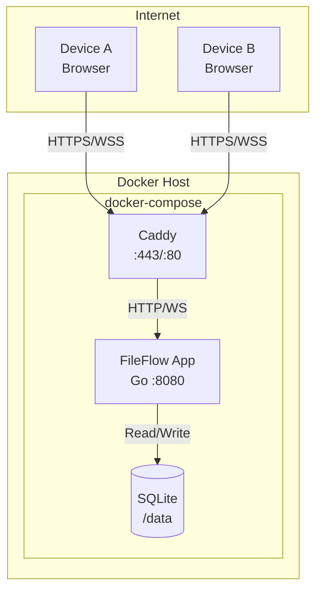

### 3.2 Technology Stack

| Layer | Technology | Rationale |
|-------|------------|-----------|
| **Reverse Proxy** | Caddy 2 | Automatic HTTPS, zero-config TLS |
| **Backend** | Go 1.21+ | Single binary, excellent WS support |
| **Database** | SQLite 3 | No external deps, single file |
| **Frontend** | Vanilla HTML/JS | Minimal footprint, WebCrypto API |

### 3.3 Component Diagram

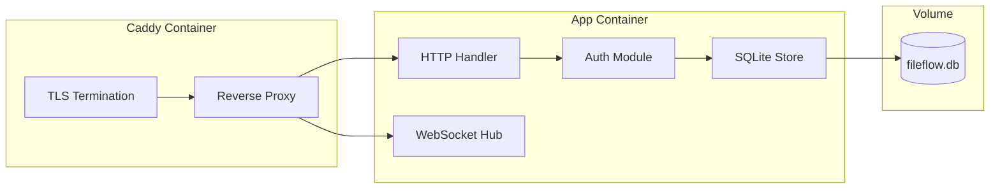

### 3.4 Request Flow

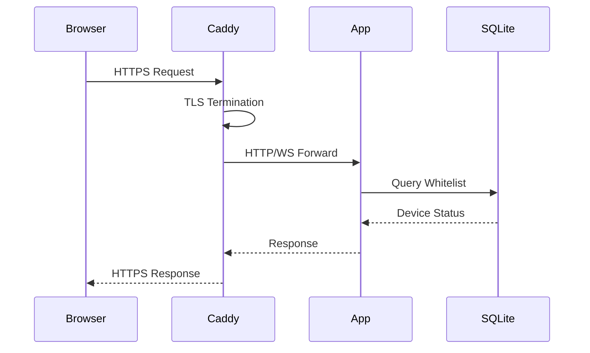

---

## 4. Security Model

### 4.1 Threat Model

| Threat | Mitigation |
|--------|------------|
| Unauthorized device access | Device whitelist + attestation |
| Brute-force attacks | Rate limiting per IP |
| Session hijacking | HttpOnly, Secure, SameSite cookies |
| Content leakage | No persistence, no logging |
| Man-in-the-middle | TLS via Caddy |

### 4.2 Device Identity

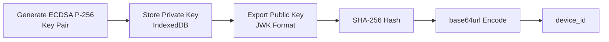

**Key Properties:**
- Algorithm: **ECDSA P-256**
- Private key: `extractable=false` (non-exportable)
- Storage: IndexedDB as `CryptoKey` handle
- Device ID: `base64url(SHA-256(canonical_json(pub_jwk)))`

### 4.3 Authentication Flow

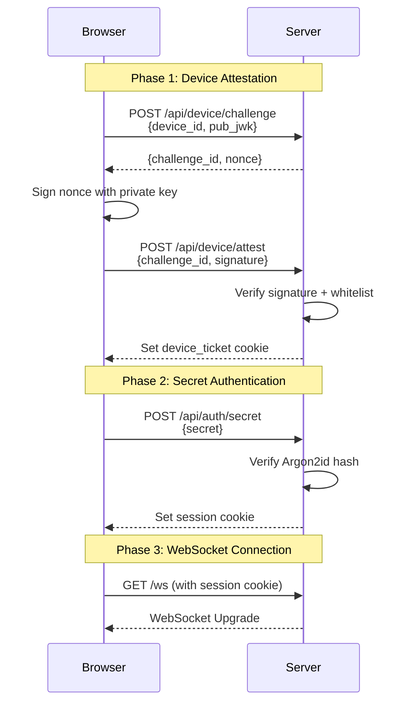

### 4.4 Session Security

| Property | Value |
|----------|-------|
| Cookie Flags | `HttpOnly`, `Secure`, `SameSite=Strict` |
| Session TTL | 12 hours |
| Secret Hash | Argon2id |

### 4.5 Rate Limiting

| Endpoint | Limit |
|----------|-------|
| `/api/device/challenge` | 5/min per IP |
| `/api/device/attest` | 5/min per IP |
| `/api/auth/secret` | 3/min per IP |
| `/ws` connections | 2/min per IP |

---

## 5. Data Model

### 5.1 Schema Diagram

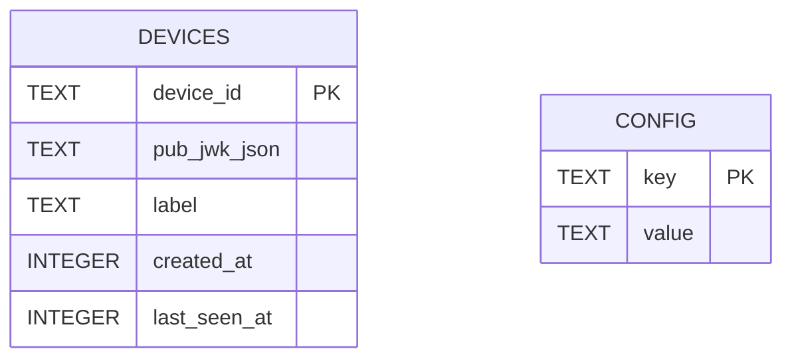

### 5.2 Table: `devices`

| Column | Type | Constraints | Description |
|--------|------|-------------|-------------|
| `device_id` | TEXT | PRIMARY KEY | Base64url hash of public key |
| `pub_jwk_json` | TEXT | NOT NULL | JSON-encoded public key |
| `label` | TEXT | NULL | Human-readable device name |
| `created_at` | INTEGER | NOT NULL | Unix timestamp (ms) |
| `last_seen_at` | INTEGER | NULL | Last successful auth |

### 5.3 Table: `config`

| Column | Type | Constraints | Description |
|--------|------|-------------|-------------|
| `key` | TEXT | PRIMARY KEY | Configuration key |
| `value` | TEXT | NOT NULL | Configuration value |

**Required Keys:**
- `secret_hash` — Argon2id hash of the secret
- `app_domain` — Origin for CORS/WebSocket validation

> [!IMPORTANT]
> No message table exists. Content is never persisted.

---

## 6. HTTP API

### 6.1 Common Response Format

```json
{
  "success": true,
  "data": { ... },
  "error": null
}
```

```json
{
  "success": false,
  "data": null,
  "error": {
    "code": "ERROR_CODE",
    "message": "Human readable message"
  }
}
```

### 6.2 Endpoints

#### Health Check

```
GET /healthz
```

| Response | Status | Body |
|----------|--------|------|
| Success | 200 | `{"ok": true}` |

---

#### Device Challenge

```
POST /api/device/challenge
Content-Type: application/json
```

**Request:**
```json
{
  "device_id": "base64url-string",
  "pub_jwk": {
    "kty": "EC",
    "crv": "P-256",
    "x": "base64url-string",
    "y": "base64url-string"
  }
}
```

**Response:**
```json
{
  "challenge_id": "uuid",
  "nonce": "base64url-string"
}
```

| Error Code | Status | Description |
|------------|--------|-------------|
| `INVALID_DEVICE_ID` | 400 | Malformed device_id |
| `INVALID_PUBLIC_KEY` | 400 | Invalid JWK format |
| `RATE_LIMITED` | 429 | Too many requests |

---

#### Device Attest

```
POST /api/device/attest
Content-Type: application/json
```

**Request:**
```json
{
  "challenge_id": "uuid",
  "device_id": "base64url-string",
  "signature": "base64url-string"
}
```

**Response (Success):**
```json
{
  "device_ok": true
}
```
*Sets `device_ticket` cookie*

**Response (Failure):**
```json
{
  "device_ok": false
}
```

| Error Code | Status | Description |
|------------|--------|-------------|
| `CHALLENGE_EXPIRED` | 400 | Challenge TTL exceeded (60s) |
| `INVALID_SIGNATURE` | 401 | Signature verification failed |
| `DEVICE_NOT_WHITELISTED` | 403 | Device not in whitelist |

---

#### Secret Authentication

```
POST /api/auth/secret
Content-Type: application/json
Cookie: device_ticket=...
```

**Request:**
```json
{
  "secret": "user-secret-string"
}
```

**Response (Success):**
```json
{
  "authed": true
}
```
*Sets `session` cookie*

**Response (Failure):**
```json
{
  "authed": false
}
```

| Error Code | Status | Description |
|------------|--------|-------------|
| `MISSING_DEVICE_TICKET` | 401 | No device_ticket cookie |
| `INVALID_SECRET` | 401 | Secret does not match |
| `RATE_LIMITED` | 429 | Too many attempts |

---

#### Presence Status

```
GET /api/presence
Cookie: session=...
```

**Response:**
```json
{
  "online": 2,
  "required": 2
}
```

---

#### Admin Device Enrollment

```
POST /api/admin/devices
Content-Type: application/json
X-Admin-Bootstrap: <BOOTSTRAP_TOKEN>
```

**Request:**
```json
{
  "device_id": "base64url-string",
  "pub_jwk": { ... },
  "label": "My MacBook"
}
```

**Response:**
```json
{
  "added": true
}
```

| Error Code | Status | Description |
|------------|--------|-------------|
| `INVALID_TOKEN` | 401 | Invalid bootstrap token |
| `DEVICE_EXISTS` | 409 | Device already enrolled |

---

## 7. WebSocket Protocol

### 7.1 Connection

```
GET /ws
Cookie: session=...
```

Single global room: `main`

### 7.2 Message Envelope

```json
{
  "t": "event_type",
  "v": { ... },
  "ts": 1730000000000
}
```

### 7.3 Event Types

| Type | Direction | Description |
|------|-----------|-------------|
| `presence` | S→C | Connection count update |
| `msg_start` | C→S→P | Begin message stream |
| `para_start` | C→S→P | Begin paragraph |
| `para_chunk` | C→S→P | Text chunk |
| `para_end` | C→S→P | End paragraph |
| `msg_end` | C→S→P | End message stream |
| `ack` | P→S→C | Delivery acknowledgement |
| `send_fail` | S→C | Delivery failure |

*C=Client, S=Server, P=Peer*

### 7.4 Event Payloads

```json
// presence
{"t": "presence", "v": {"online": 2, "required": 2}}

// msg_start
{"t": "msg_start", "v": {"msgId": "uuid"}}

// para_start
{"t": "para_start", "v": {"msgId": "uuid", "i": 0}}

// para_chunk
{"t": "para_chunk", "v": {"msgId": "uuid", "i": 0, "s": "text..."}}

// para_end
{"t": "para_end", "v": {"msgId": "uuid", "i": 0}}

// msg_end
{"t": "msg_end", "v": {"msgId": "uuid"}}

// ack
{"t": "ack", "v": {"msgId": "uuid"}}

// send_fail
{"t": "send_fail", "v": {"msgId": "uuid", "reason": "peer_offline"}}
```

### 7.5 Limits

| Parameter | Value |
|-----------|-------|
| `para_chunk` max size | 4 KB UTF-8 |
| Message total max | 256 KB |
| Paragraphs per message | 512 |
| WebSocket frame max | 256 KB |

---

## 8. State Machines

### 8.1 Client Connection State

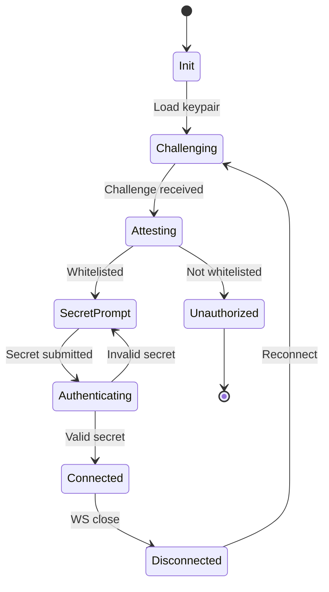

### 8.2 Message Transmission State

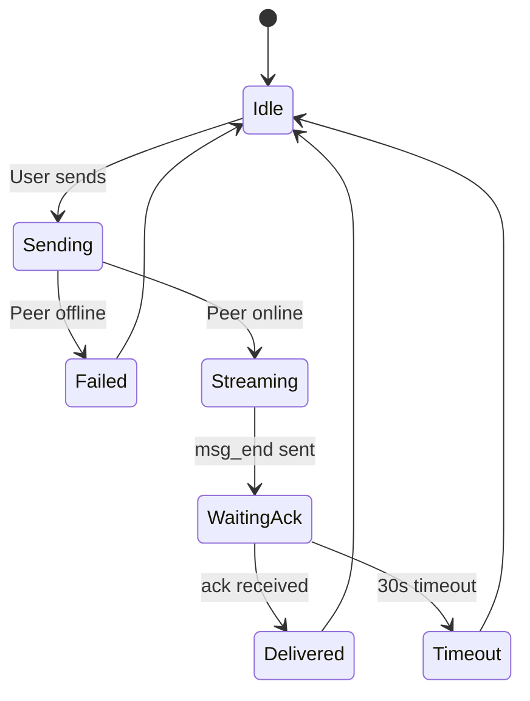

### 8.3 Message Reception State

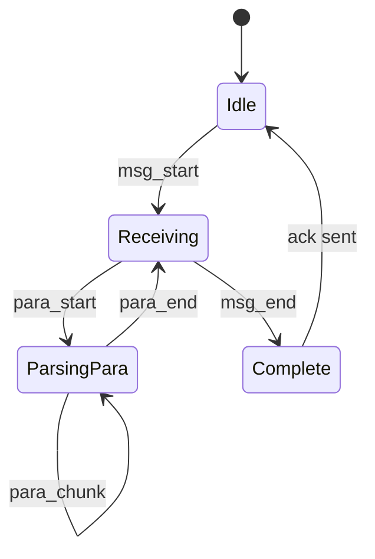

---

## 9. Error Handling

### 9.1 Error Codes

| Code | HTTP | Description | Client Action |
|------|------|-------------|---------------|
| `INVALID_DEVICE_ID` | 400 | Malformed device ID | Regenerate keypair |
| `INVALID_PUBLIC_KEY` | 400 | Invalid JWK format | Regenerate keypair |
| `CHALLENGE_EXPIRED` | 400 | Challenge timeout | Retry challenge |
| `INVALID_SIGNATURE` | 401 | Signature mismatch | Check key integrity |
| `MISSING_DEVICE_TICKET` | 401 | No device cookie | Restart auth flow |
| `INVALID_SECRET` | 401 | Wrong secret | Show error, allow retry |
| `DEVICE_NOT_WHITELISTED` | 403 | Not enrolled | Show unauthorized |
| `RATE_LIMITED` | 429 | Too many requests | Exponential backoff |
| `INTERNAL_ERROR` | 500 | Server error | Retry with backoff |

### 9.2 WebSocket Error Handling

| Condition | Action |
|-----------|--------|
| Connection lost | Auto-reconnect with exponential backoff |
| Invalid message | Log and ignore |
| Size limit exceeded | Close connection |
| `send_fail` received | Show "Peer offline" to user |

### 9.3 Retry Strategy

```
Base delay: 1 second
Max delay: 30 seconds
Multiplier: 2
Jitter: ±20%
Max attempts: 5
```

---

## 10. Frontend Implementation

### 10.1 Boot Sequence

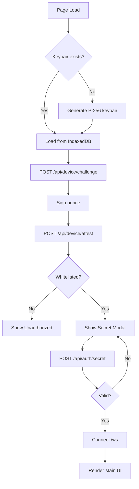

### 10.2 Paragraph Parsing

```javascript
function parseParagraphs(text) {
  return text.split(/\n\n+/).filter(p => p.length > 0);
}
```

### 10.3 Chunking Algorithm

```javascript
const CHUNK_SIZE = 4096; // 4KB

function* chunkText(text) {
  for (let i = 0; i < text.length; i += CHUNK_SIZE) {
    yield text.slice(i, i + CHUNK_SIZE);
  }
}
```

### 10.4 CSS Rendering

```css
.paragraph {
  white-space: pre-wrap;
  margin-bottom: 1em;
}

.message-bubble {
  padding: 12px 16px;
  border-radius: 12px;
}
```

---

## 11. Backend Design

### 11.1 Package Structure

```
fileflow/
├── cmd/
│   └── server/
│       └── main.go
├── internal/
│   ├── auth/
│   │   ├── challenge.go
│   │   ├── session.go
│   │   └── secret.go
│   ├── handler/
│   │   ├── api.go
│   │   └── middleware.go
│   ├── realtime/
│   │   ├── hub.go
│   │   ├── client.go
│   │   └── events.go
│   └── store/
│       ├── sqlite.go
│       └── device.go
├── web/
│   └── static/
│       ├── index.html
│       ├── app.js
│       └── style.css
├── Dockerfile
├── docker-compose.yml
└── Caddyfile
```

### 11.2 Challenge Store

```go
type ChallengeStore struct {
    mu         sync.RWMutex
    challenges map[string]*Challenge
    ttl        time.Duration // 60s
}

type Challenge struct {
    DeviceID  string
    Nonce     []byte
    ExpiresAt time.Time
}
```

### 11.3 Realtime Hub

```go
type Hub struct {
    mu          sync.RWMutex
    clients     map[*Client]bool
    broadcast   chan []byte
    register    chan *Client
    unregister  chan *Client
}

func (h *Hub) OnlineCount() int {
    h.mu.RLock()
    defer h.mu.RUnlock()
    return len(h.clients)
}
```

---

## 12. Docker Deployment

### 12.1 Architecture

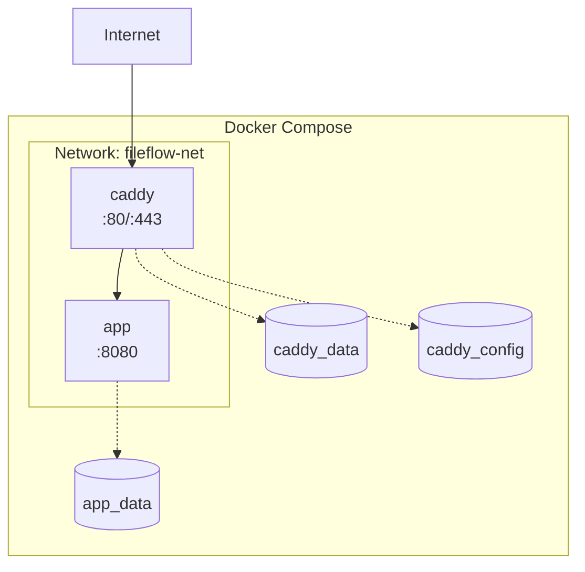

### 12.2 Files Structure

```
deployment/
├── docker-compose.yml
├── docker-compose.prod.yml
├── Dockerfile
├── Caddyfile
├── .env.example
└── scripts/
    ├── init-secret.sh
    └── enroll-device.sh
```

### 12.3 Dockerfile

```dockerfile
# Build stage
FROM golang:1.21-alpine AS builder

WORKDIR /app
COPY go.mod go.sum ./
RUN go mod download

COPY . .
RUN CGO_ENABLED=1 GOOS=linux go build -o fileflow ./cmd/server

# Runtime stage
FROM alpine:3.19

RUN apk add --no-cache ca-certificates sqlite

WORKDIR /app
COPY --from=builder /app/fileflow .
COPY --from=builder /app/web/static ./static

EXPOSE 8080

HEALTHCHECK --interval=30s --timeout=3s --start-period=5s \
  CMD wget -q --spider http://localhost:8080/healthz || exit 1

ENTRYPOINT ["./fileflow"]
```

### 12.4 docker-compose.yml

```yaml
version: "3.9"

services:
  caddy:
    image: caddy:2-alpine
    restart: unless-stopped
    ports:
      - "80:80"
      - "443:443"
    volumes:
      - ./Caddyfile:/etc/caddy/Caddyfile:ro
      - caddy_data:/data
      - caddy_config:/config
    networks:
      - fileflow-net
    depends_on:
      app:
        condition: service_healthy

  app:
    build:
      context: .
      dockerfile: Dockerfile
    restart: unless-stopped
    environment:
      - APP_DOMAIN=${APP_DOMAIN}
      - BOOTSTRAP_TOKEN=${BOOTSTRAP_TOKEN}
      - SQLITE_PATH=/data/fileflow.db
      - RATE_LIMIT_RPS=${RATE_LIMIT_RPS:-5}
      - MAX_WS_MSG_BYTES=${MAX_WS_MSG_BYTES:-262144}
    volumes:
      - app_data:/data
    networks:
      - fileflow-net
    expose:
      - "8080"
    healthcheck:
      test: ["CMD", "wget", "-q", "--spider", "http://localhost:8080/healthz"]
      interval: 30s
      timeout: 3s
      retries: 3
      start_period: 5s

networks:
  fileflow-net:
    driver: bridge

volumes:
  caddy_data:
  caddy_config:
  app_data:
```

### 12.5 docker-compose.prod.yml (Override)

```yaml
version: "3.9"

services:
  caddy:
    logging:
      driver: "json-file"
      options:
        max-size: "10m"
        max-file: "3"

  app:
    logging:
      driver: "json-file"
      options:
        max-size: "10m"
        max-file: "3"
    deploy:
      resources:
        limits:
          memory: 256M
        reservations:
          memory: 64M
```

### 12.6 Caddyfile

```caddyfile
{
    email {$ACME_EMAIL:admin@example.com}
}

{$APP_DOMAIN} {
    encode gzip

    # Security headers
    header {
        Strict-Transport-Security "max-age=31536000; includeSubDomains"
        X-Content-Type-Options "nosniff"
        X-Frame-Options "DENY"
        X-XSS-Protection "1; mode=block"
        Referrer-Policy "strict-origin-when-cross-origin"
    }

    # WebSocket
    @websocket {
        path /ws
        header Connection *Upgrade*
        header Upgrade websocket
    }
    reverse_proxy @websocket app:8080

    # API
    @api {
        path /api/*
        path /healthz
    }
    reverse_proxy @api app:8080

    # Static files
    reverse_proxy app:8080
}
```

### 12.7 Environment Variables (.env.example)

```bash
# Required
APP_DOMAIN=fileflow.example.com
BOOTSTRAP_TOKEN=your-secure-random-token-here

# Optional
RATE_LIMIT_RPS=5
MAX_WS_MSG_BYTES=262144
ACME_EMAIL=admin@example.com
```

### 12.8 Deployment Commands

```bash
# Development
docker compose up --build

# Production
docker compose -f docker-compose.yml -f docker-compose.prod.yml up -d

# View logs
docker compose logs -f

# Initialize secret (first time)
docker compose exec app ./scripts/init-secret.sh

# Enroll device
docker compose exec app ./scripts/enroll-device.sh <device_id> <label>

# Backup database
docker compose exec app sqlite3 /data/fileflow.db ".backup /data/backup.db"

# Update
docker compose pull
docker compose -f docker-compose.yml -f docker-compose.prod.yml up -d
```

### 12.9 Health Checks

| Service | Endpoint | Interval |
|---------|----------|----------|
| app | `GET /healthz` | 30s |
| caddy | TCP :443 | 30s |

---

## 13. Configuration Reference

### 13.1 Environment Variables

| Variable | Required | Default | Description |
|----------|----------|---------|-------------|
| `APP_DOMAIN` | ✅ | - | Domain for CORS and origin checks |
| `BOOTSTRAP_TOKEN` | ✅ | - | Admin enrollment token |
| `SQLITE_PATH` | ❌ | `/data/fileflow.db` | Database file path |
| `RATE_LIMIT_RPS` | ❌ | `5` | Rate limit per second |
| `MAX_WS_MSG_BYTES` | ❌ | `262144` | Max WebSocket message (256KB) |
| `SESSION_TTL_HOURS` | ❌ | `12` | Session cookie TTL |
| `CHALLENGE_TTL_SEC` | ❌ | `60` | Challenge expiry |
| `ACME_EMAIL` | ❌ | - | Email for Let's Encrypt |

### 13.2 Limits

| Parameter | Value | Configurable |
|-----------|-------|--------------|
| Challenge TTL | 60s | Yes |
| Session TTL | 12h | Yes |
| Max chunk size | 4KB | No |
| Max message size | 256KB | Yes |
| Max paragraphs | 512 | No |
| Rate limit (auth) | 5/min | Yes |

---

## 14. Testing Strategy

### 14.1 Unit Tests

| Component | Test Cases |
|-----------|------------|
| Paragraph parser | Empty, single, multiple, whitespace preservation |
| Chunking | Exact size, larger, UTF-8 boundaries |
| Signature verification | Valid, invalid, expired |
| Argon2id | Hash generation, verification |

### 14.2 Integration Tests

| Scenario | Expected Outcome |
|----------|------------------|
| Two clients connect | Presence shows 2/2 |
| Send with peer online | Content streams correctly |
| Send with peer offline | `send_fail(peer_offline)` |
| Ack reception | Sender shows "Delivered" |
| Multi-paragraph message | Boundaries preserved |

### 14.3 Load Tests

```bash
# Using k6
k6 run --vus 10 --duration 60s ./tests/load/websocket.js
```

| Metric | Target |
|--------|--------|
| Latency p99 | < 100ms |
| Throughput | 100 msg/s |
| Memory | < 256MB |

---

## 15. Acceptance Criteria

| ID | Criterion | Verification |
|----|-----------|--------------|
| AC1 | Non-whitelisted device cannot see secret prompt | Manual test |
| AC2 | Non-whitelisted device cannot connect to WS | Integration test |
| AC3 | Whitelisted device must pass secret | Integration test |
| AC4 | Single device online → send fails | Integration test |
| AC5 | Two devices online → streaming works | Integration test |
| AC6 | Paragraph boundaries preserved | Unit test |
| AC7 | Sender receives ack → shows delivered | Integration test |
| AC8 | Restart preserves whitelist (no messages) | Integration test |
| AC9 | Docker deployment works | CI/CD test |

---

## 16. Roadmap

### 16.1 Future Extensions

| Feature | Impact on Current Design |
|---------|-------------------------|
| E2E Encryption | Add client-side encryption; protocol unchanged |
| Multi-room | Add `roomId` to session and WS query |
| Files/Documents | New event types + separate storage |
| Offline Queue | Add Redis + message persistence |

### 16.2 Compatibility Notes

> [!NOTE]
> The current chunk-based streaming protocol is designed to accommodate future E2E encryption. Encrypted payloads can replace plaintext chunks without protocol changes.

---

## Appendix A: Quick Start

```bash
# 1. Clone and configure
git clone https://github.com/your/fileflow.git
cd fileflow
cp .env.example .env
# Edit .env with your domain and bootstrap token

# 2. Start services
docker compose up -d

# 3. Initialize secret
docker compose exec app ./scripts/init-secret.sh

# 4. Access https://your-domain.com
# 5. Follow device enrollment flow
```

---

## Appendix B: Security Checklist

- [ ] `BOOTSTRAP_TOKEN` is cryptographically random (32+ bytes)
- [ ] `.env` file is not committed to version control
- [ ] TLS certificates are valid and auto-renewed
- [ ] Rate limiting is enabled
- [ ] No message content in logs
- [ ] SQLite file has restricted permissions
- [ ] Regular database backups configured
- [ ] Container images are from trusted sources
- [ ] Security headers are properly set

---

*Document generated: 2026-01-13*
