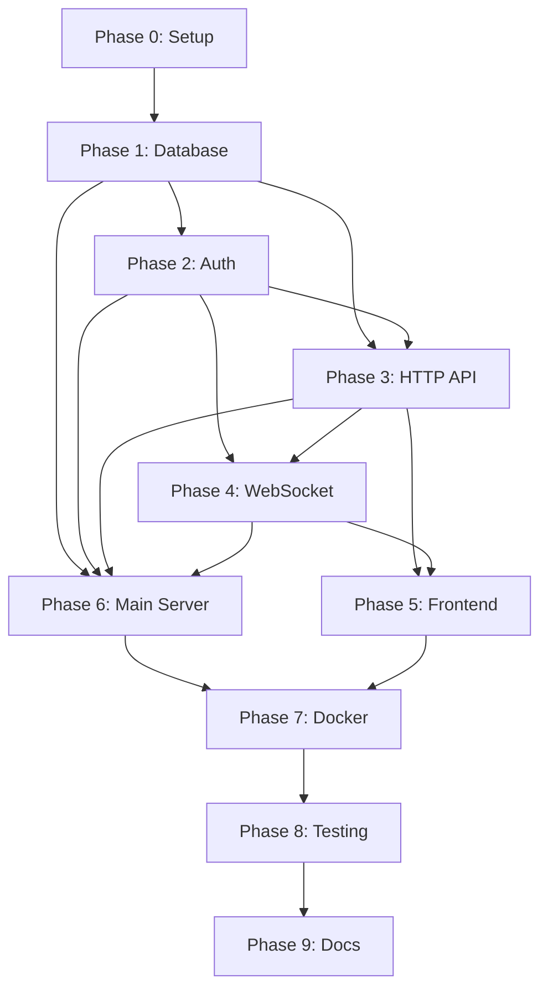

# FileFlow MVP — Implementation Tasks

> **Based on:** FileFlow-Technical-Spec-v2.md  
> **Created:** 2026-01-13  
> **Target:** Complete MVP implementation

---

## Phase 0: Project Setup

- [ ] **P0.1** Initialize Go module
  - `go mod init github.com/your/fileflow`
- [ ] **P0.2** Create directory structure
  ```
  fileflow/
  ├── cmd/server/
  ├── internal/auth/
  ├── internal/handler/
  ├── internal/realtime/
  ├── internal/store/
  └── web/static/
  ```
- [ ] **P0.3** Setup development environment
  - Install Go 1.21+
  - Install SQLite3
  - Setup Docker Desktop

---

## Phase 1: Database Layer

### 1.1 SQLite Store
- [ ] **T1.1.1** Create `internal/store/sqlite.go`
  - Database initialization
  - Schema migration
  - Connection management
- [ ] **T1.1.2** Create `devices` table
  - `device_id` TEXT PRIMARY KEY
  - `pub_jwk_json` TEXT NOT NULL
  - `label` TEXT NULL
  - `created_at` INTEGER NOT NULL
  - `last_seen_at` INTEGER NULL
- [ ] **T1.1.3** Create `config` table
  - `key` TEXT PRIMARY KEY
  - `value` TEXT NOT NULL
- [ ] **T1.1.4** Implement device CRUD operations
  - `AddDevice()`
  - `GetDevice()`
  - `ListDevices()`
  - `UpdateLastSeen()`
  - `IsWhitelisted()`
- [ ] **T1.1.5** Implement config operations
  - `GetConfig()`
  - `SetConfig()`
- [ ] **T1.1.6** Write unit tests for store

---

## Phase 2: Authentication Module

### 2.1 Challenge/Response
- [ ] **T2.1.1** Create `internal/auth/challenge.go`
  - In-memory challenge store
  - TTL 60 seconds
  - Cleanup goroutine (30s tick)
- [ ] **T2.1.2** Implement `GenerateChallenge()`
  - Generate random nonce (32 bytes)
  - Generate challenge_id (UUID)
  - Store with expiration
- [ ] **T2.1.3** Implement `VerifyChallenge()`
  - Lookup challenge by ID
  - Check expiration
  - Delete after use

### 2.2 Signature Verification
- [ ] **T2.2.1** Implement ECDSA P-256 signature verification
  - Parse JWK public key
  - Verify signature against nonce
- [ ] **T2.2.2** Implement `VerifyDeviceAttestation()`
  - Verify signature
  - Check whitelist
  - Return device_ticket cookie

### 2.3 Secret Authentication
- [ ] **T2.3.1** Implement Argon2id hashing
  - `HashSecret()`
  - `VerifySecret()`
- [ ] **T2.3.2** Create `internal/auth/session.go`
  - Session cookie generation
  - Session validation middleware
- [ ] **T2.3.3** Implement session management
  - 12-hour TTL
  - `HttpOnly`, `Secure`, `SameSite=Strict`
- [ ] **T2.3.4** Write unit tests for auth module

---

## Phase 3: HTTP API

### 3.1 Core Setup
- [ ] **T3.1.1** Create `internal/handler/api.go`
  - Router setup
  - Middleware chain
- [ ] **T3.1.2** Implement middleware
  - Rate limiting (per IP)
  - CORS handling
  - Request size limits
  - Logging (no content)

### 3.2 Endpoints
- [ ] **T3.2.1** `GET /healthz`
  - Return `{"ok": true}`
- [ ] **T3.2.2** `POST /api/device/challenge`
  - Validate device_id format
  - Validate pub_jwk format
  - Generate and return challenge
- [ ] **T3.2.3** `POST /api/device/attest`
  - Verify challenge exists
  - Verify signature
  - Check whitelist
  - Set device_ticket cookie
- [ ] **T3.2.4** `POST /api/auth/secret`
  - Require device_ticket cookie
  - Verify secret against hash
  - Set session cookie
- [ ] **T3.2.5** `GET /api/presence`
  - Require session cookie
  - Return online count
- [ ] **T3.2.6** `POST /api/admin/devices`
  - Require X-Admin-Bootstrap header
  - Add device to whitelist
- [ ] **T3.2.7** Static file serving
  - Serve `web/static/` directory
- [ ] **T3.2.8** Write integration tests for API

---

## Phase 4: WebSocket Realtime

### 4.1 Hub Implementation
- [ ] **T4.1.1** Create `internal/realtime/hub.go`
  - Client registry
  - Broadcast channel
  - Register/unregister channels
- [ ] **T4.1.2** Implement `Hub.Run()`
  - Event loop
  - Client management
  - Presence tracking
- [ ] **T4.1.3** Implement `Hub.OnlineCount()`
- [ ] **T4.1.4** Implement `Hub.Broadcast()`

### 4.2 Client Handling
- [ ] **T4.2.1** Create `internal/realtime/client.go`
  - WebSocket connection wrapper
  - Read/write pumps
- [ ] **T4.2.2** Implement `Client.ReadPump()`
  - Parse incoming events
  - Route to hub
- [ ] **T4.2.3** Implement `Client.WritePump()`
  - Send outgoing events
  - Handle pings/pongs

### 4.3 Event Processing
- [ ] **T4.3.1** Create `internal/realtime/events.go`
  - Event envelope struct
  - Event type constants
- [ ] **T4.3.2** Implement event types
  - `presence`
  - `msg_start`
  - `para_start`
  - `para_chunk`
  - `para_end`
  - `msg_end`
  - `ack`
  - `send_fail`
- [ ] **T4.3.3** Implement online-only gating
  - Check `online_count >= 2` on `msg_start`
  - Send `send_fail` if peer offline
- [ ] **T4.3.4** Implement message forwarding
  - Forward events to peer
  - No content storage
- [ ] **T4.3.5** Implement size limits
  - `para_chunk` max 4KB
  - Message total max 256KB
  - Max 512 paragraphs
- [ ] **T4.3.6** Write integration tests for WebSocket

---

## Phase 5: Frontend

### 5.1 Key Management
- [ ] **T5.1.1** Create `web/static/app.js`
- [ ] **T5.1.2** Implement keypair generation
  - ECDSA P-256
  - `extractable=false`
- [ ] **T5.1.3** Implement IndexedDB storage
  - Store CryptoKey handle
  - Load on page load
- [ ] **T5.1.4** Implement device_id computation
  - Export public key JWK
  - Canonical JSON
  - SHA-256 hash
  - Base64url encode

### 5.2 Authentication Flow
- [ ] **T5.2.1** Implement challenge flow
  - POST /api/device/challenge
  - Sign nonce with private key
  - POST /api/device/attest
- [ ] **T5.2.2** Implement unauthorized view
  - "Unauthorized device" message
  - No secret prompt shown
- [ ] **T5.2.3** Implement secret prompt modal
  - Input field
  - Submit button
  - Error display
- [ ] **T5.2.4** Implement secret submission
  - POST /api/auth/secret
  - Handle success/failure

### 5.3 WebSocket Connection
- [ ] **T5.3.1** Implement WebSocket manager
  - Connect to /ws
  - Auto-reconnect with backoff
- [ ] **T5.3.2** Implement event handlers
  - `presence` → update UI
  - `msg_start` → create bubble
  - `para_start` → create paragraph
  - `para_chunk` → append text
  - `para_end` → mark complete
  - `msg_end` → send ack
  - `send_fail` → show error

### 5.4 Sender Implementation
- [ ] **T5.4.1** Implement text input area
  - Multi-line input
  - Paste support
- [ ] **T5.4.2** Implement paragraph parser
  - Split on `\n\n+`
- [ ] **T5.4.3** Implement chunking
  - 4KB chunks
- [ ] **T5.4.4** Implement send flow
  - Check presence >= 2
  - Send msg_start
  - For each paragraph: para_start, chunks, para_end
  - Send msg_end
  - Wait for ack

### 5.5 Receiver Implementation
- [ ] **T5.5.1** Implement message bubble creation
- [ ] **T5.5.2** Implement paragraph container
- [ ] **T5.5.3** Implement streaming text append
- [ ] **T5.5.4** Implement ack sending

### 5.6 UI/Styling
- [ ] **T5.6.1** Create `web/static/style.css`
- [ ] **T5.6.2** Implement presence bar
- [ ] **T5.6.3** Implement composer area
- [ ] **T5.6.4** Implement message stream
- [ ] **T5.6.5** Implement paragraph styling
  - `white-space: pre-wrap`
  - Vertical spacing

### 5.7 HTML
- [ ] **T5.7.1** Create `web/static/index.html`
  - Meta tags
  - CSS link
  - JS script
  - Container elements

---

## Phase 6: Main Server

- [ ] **T6.1** Create `cmd/server/main.go`
  - Load configuration from env
  - Initialize SQLite store
  - Initialize auth module
  - Initialize realtime hub
  - Start HTTP server
- [ ] **T6.2** Implement graceful shutdown
  - Signal handling
  - Connection draining
- [ ] **T6.3** Implement startup validation
  - Check required env vars
  - Verify database access
  - Verify secret_hash exists

---

## Phase 7: Docker Deployment

### 7.1 Dockerfile
- [ ] **T7.1.1** Create multi-stage Dockerfile
  - Builder stage: golang:1.21-alpine
  - Runtime stage: alpine:3.19
- [ ] **T7.1.2** Add healthcheck
  - `wget -q --spider http://localhost:8080/healthz`
- [ ] **T7.1.3** Build and test locally

### 7.2 Docker Compose
- [ ] **T7.2.1** Create `docker-compose.yml`
  - caddy service
  - app service
  - volumes: caddy_data, caddy_config, app_data
  - network: fileflow-net
- [ ] **T7.2.2** Create `docker-compose.prod.yml`
  - Logging configuration
  - Resource limits
- [ ] **T7.2.3** Create `Caddyfile`
  - Automatic HTTPS
  - WebSocket forwarding
  - Security headers
- [ ] **T7.2.4** Create `.env.example`

### 7.3 Scripts
- [ ] **T7.3.1** Create `scripts/init-secret.sh`
  - Generate Argon2id hash
  - Store in database
- [ ] **T7.3.2** Create `scripts/enroll-device.sh`
  - Add device to whitelist

### 7.4 Deployment Verification
- [ ] **T7.4.1** Test docker compose up
- [ ] **T7.4.2** Test HTTPS access
- [ ] **T7.4.3** Test WebSocket connection
- [ ] **T7.4.4** Test device enrollment
- [ ] **T7.4.5** Test full flow (two devices)

---

## Phase 8: Testing & Verification

### 8.1 Unit Tests
- [ ] **T8.1.1** Paragraph parser tests
- [ ] **T8.1.2** Chunking tests
- [ ] **T8.1.3** Signature verification tests
- [ ] **T8.1.4** Argon2id tests

### 8.2 Integration Tests
- [ ] **T8.2.1** Two WS clients, presence 2/2
- [ ] **T8.2.2** Streaming events reconstruct paragraphs
- [ ] **T8.2.3** Offline gating returns send_fail
- [ ] **T8.2.4** Ack returns to sender
- [ ] **T8.2.5** Unauthorized device blocked

### 8.3 Acceptance Criteria Verification
- [ ] **AC1** Non-whitelisted device cannot see secret prompt
- [ ] **AC2** Non-whitelisted device cannot connect to WS
- [ ] **AC3** Whitelisted device must pass secret
- [ ] **AC4** Single device online → send fails
- [ ] **AC5** Two devices online → streaming works
- [ ] **AC6** Paragraph boundaries preserved
- [ ] **AC7** Sender receives ack → shows delivered
- [ ] **AC8** Restart preserves whitelist (no messages)
- [ ] **AC9** Docker deployment works

---

## Phase 9: Documentation

- [ ] **T9.1** Create README.md
- [ ] **T9.2** Document environment variables
- [ ] **T9.3** Document deployment steps
- [ ] **T9.4** Document device enrollment
- [ ] **T9.5** Create CHANGELOG.md

---

## Task Summary

| Phase | Tasks | Description |
|-------|-------|-------------|
| P0 | 3 | Project Setup |
| P1 | 6 | Database Layer |
| P2 | 8 | Authentication Module |
| P3 | 8 | HTTP API |
| P4 | 12 | WebSocket Realtime |
| P5 | 21 | Frontend |
| P6 | 3 | Main Server |
| P7 | 9 | Docker Deployment |
| P8 | 14 | Testing & Verification |
| P9 | 5 | Documentation |
| **Total** | **89** | |

---

## Dependency Graph



---

## Estimated Timeline

| Phase | Duration | Cumulative |
|-------|----------|------------|
| P0 | 0.5 day | 0.5 days |
| P1 | 1 day | 1.5 days |
| P2 | 1.5 days | 3 days |
| P3 | 1.5 days | 4.5 days |
| P4 | 2 days | 6.5 days |
| P5 | 2.5 days | 9 days |
| P6 | 0.5 day | 9.5 days |
| P7 | 1 day | 10.5 days |
| P8 | 1.5 days | 12 days |
| P9 | 0.5 day | 12.5 days |

**Total Estimate: ~12-13 working days**
